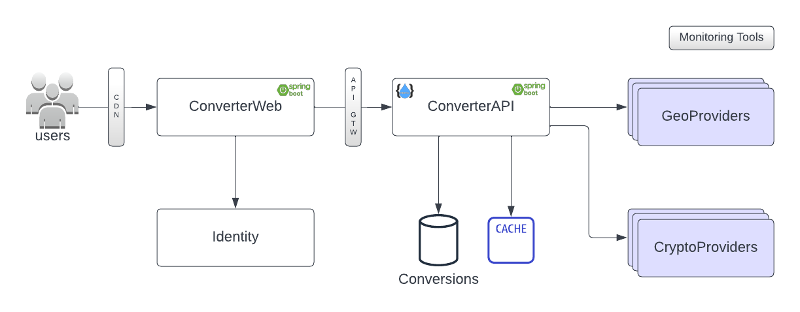

# converter
Currency Converter

This is a Spring boot application that listens on port 8080, with the functionalities detailed below. It uses openjdk:11-jdk-slim as base docker image.

This project requires Java 11, and Maven 3.6 or greater.

### Build Container

Building the container is a multi-step process.

##### Local development

- Run the below command to build the image.

```
docker build -t sunilmnambiar/converter .
```

### Run Container


##### Using docker command


To run container locally, run:

```
docker run --name converter -p 80:8080 sunilmnambiar/converter
```

To view container logs, run following command:

```
docker logs <container id>
```


### Accessing the application

The application once deployed can be accessed with: `http://localhost:80/`

Use the credentials `admin`/`password`


### CI/CD
To build the Jenkins image, run:

```
docker build -f Dockerfile_Jenkins -t sunilmnambiar/jenkins .
```

To run the Jenkins container:

```
docker run --name jenkins -p 8080:8080 -p 50000:50000 --privileged=true -v jenkins_home:/var/jenkins_home -v /var/run/docker.sock:/var/run/docker.sock --restart unless-stopped sunilmnambiar/jenkins
```

##### Setting up Jenkins

- Access Jenkins insance via http://localhost:8080/
- Enter the Administrator user password (get it from the container log)
- Click on 'Install Suggested Plugins' (Grab a cup of coffee as this step takes some time to complete!)
- Create the admin user admin/password
- Click on Create a Job
- Give name as 'converter-pipeline' and type 'Pipeline'
- Project url: https://github.com/sunilmnambiar/converter
- Pipeline script from SCM, Repository url: https://github.com/sunilmnambiar/converter, branch main
- Script path: Jenkinsfile
- Build the pipeline

Application will be accessible at http://localhost:80/

Login with credential admin/password

### Architecture

 Assertions:
- Only top 10 Crypto currencies supported (can be added from backend)
- IP to location uses GeoPlugin service (caching for 12 hours)
- Live currency rates retrieved from CoinGecko (caching for 5 minutes)

MVP


Target Architecture


Scheenshots


